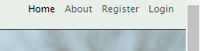

[Click here for live site](https://herdhub-ef517bdcab8e.herokuapp.com)

[](https://github.com/cthlbrennan/herdhub/commits/main)
[](https://github.com/cthlbrennan/herdhub/commits/main)
[](https://github.com/cthlbrennan/herdhub)


Source: [amiresponsive](https://ui.dev/amiresponsive?url=https://herdhub-ef517bdcab8e.herokuapp.com)

 Herdhub is a livestock management web application for dairy farmers. Designed with ease-of-use as a priority, the website allows dairy farmers to catalogue the key details of every animal in their herd. Users can also record breeding logs between animals to newborn calves, enabling them to easily and efficiently manage their livestock. Users can easily register their account and safely store the data of their herd within an intuitive dashboard-style user interface. 

 The name Herdhub is derived from Github, as the website acts as a repository for the herd data of its individual registered users in a manner similar to how Github is used for programmers. In a similar vein, the Herdhub logo also takes inspiration from Github's cat logo. 

## UX

The primary goal was to provide an easy-to-use interface that would allow users to update the details of their herd with minimal fuss. Providing users with an up-to-date herd overview immediately upon signing in, the app is simple, intuitive and responsive to user interaction through pop-up messages confirming their actions.  

### Colour Scheme

To reflect the application's utility for the agricultural industry, the palette is primarily typified by contrasting shades of green in addition to black and white. 


Source: [coolors.co](https://www.coolors.co)

### Typography

The typeface used is Lucida Sans, a sans-serif font that allows for easy readability and aligns with the practical design ethos of the application. 

Social media brand icons from [Font Awesome](https://fontawesome.com) are used in the footer.

## User Stories

User stories formed a key part of the Agile methodology which guided the development of this application. They can be found within the Product Backlog on Github 
[here](https://github.com/users/cthlbrennan/projects/3).

### Users

- As a new user, I want to have a clear idea of the purpose of the web application so that I can understand the value that it would provide me.
- As a user, I want to be able to log in through my gmail or social media account.
- As a user, I want to be able to reset my password so that I can regain access to my database in case I forget the original.
- As a user, I want to add photos to animal profiles so that I can include photos within my database.
- As the product owner, if a user submits a message then I want them to receive a confirmation email telling them that their message has been submitted to improve the user experience.
- As a user, I want to be able to log out easily so that I can be sure that my data remains secure after I have finished using the website.
- As a user, I want to be able to change the details of a specific animal so that my database remains up-to-date.
- As a user, I want to create profiles for each of my animals so that I can easily track their individual history and characteristics.
- As a user, I want to view a list of all animals in my herd with key details shown, so that I can read an overview of my herd.
- As a user, I want to be able to select a specific animal or breeding event and access comprehensive detailed overview of it.
- As a user, I want to log breeding events so that I can monitor reproductive outcomes and optimise my breeding program.
- As a user, I want to be able to delete animals from my database in case an animal is sold, dies, etc, so that I can maintain an accurate database.
- As a user, I want to be able to register an account so that I can manage my livestock.
- As a user, I want to be able to log in with a username and password so that I can securely access my data.
- As a logged in user, I want to navigate my records easily so that I can easily access my data.

### Product Owner

- As the product owner, if a user submits a message then I want them to receive a confirmation email telling them that their message has been submitted to improve the user experience.
- As the product owner, I want to make sure that the models are full functional so that users don't experience bugs.
- As the product owner, I want users to get messages after they've logged in, logged out, successfully added an animal, etc so that they get immediate feedback on their interactions.
- As the product owner, I want there to be an admin account so that the website can be monitored and maintained.
- As the product owner, I want to make sure that all code is validated so that the code is clean, readable and maintainable.
- As the product owner, I want to ensure that my deployed website is linked to a cloud-based database.
- As the product owner, I want to have the website deployed so that people can find and use my product.
- As the product owner, I want the website to have a robust database schema that would serve the needs of users.
- As the product owner, I want the authentication pages to match the appearance of the rest of the site so that the site will have a coherent, consistent and professional appearance.

### Site Administrator

- As the administrator, I want to be able to securely access the admin page so that I can maintain and update the website easily.
- As the administrator, I want to have CRUD functionality over all users' databases so that I can monitor and maintain the website.
- As the administrator, I want users to be able to submit messages to me so that I can troubleshoot any problems they might have.


## Wireframes

To follow best practice, wireframes were developed for mobile, tablet, and desktop sizes.

I've used [Balsamiq](https://balsamiq.com/wireframes) to design my site wireframes.

Home
  

Dashboard
  

Add Cow Page
  

Edit Cow Page
  

Delete Cow Modal
  

## Features

### Existing Features

#### Logo


Upon entering the page, the logo is apparent in the top left corner. This tells the user what website they are on. It is also clickable, allowing users to navigate easily and directly back to the home page from any other page.

#### Navigation Bar


Upon entering the page, it is immediately apparent to the user that there is a menu that provides them links to the pages of the website. This makes the page easily navigable for the user. 

The page that the user is actively on will be a darker shade in the navbar. This helps the user to orient themselves within the website, following best principles of good UX design. 

The options available on the navbar also change depending on whether the user is logged in or not. When logged out, the navbar appears as shown below.



#### Dropdown Menu


At mobile and tablet screen width, the menu options are accessed through a dropdown menu via a hamburger icon.

#### Hero Image on Index Page


For users who are not signed in, the home page is characterised by the large hero image featuring a herd of cows. The overlaid text welcomes the user to the website and provides a quick and catchy slogan that summarises the website's utility. 

#### About Section


The About page provides more information to users on the utility of the website, as well as as another hero image. The website respects the user's time by cutting right to the core of the business. 

#### Call-to-Action Buttons


At the bottom of the About page, there are two large buttons which invite the user to register now, or log in if they have an account, underneath emboldened large text. These call-to-action buttons encourage interaction from the user. 

#### Testimonials


Located at the bottom of the home page and visible when not logged in, this section gives three reviews of Herdhub within a Bootstrap carousel component. This is visually engaging and adds extra sheen to the user experience. 

#### Favicon


The pages of the website have a favicon of the logo. Furthermore, the title on the tab changes depending on the page that the user is on. 

#### Footer


The footer is present on every page. It contains social media links, as well as links to other pages on the website; these links change depending on whether the user is logged in or not, just like the navbar. This is shown below. 


The copyright line at the bottom of the footer utilises Django Template Language functionality that allows for the year to be updated automatically without any maintenance from the product owner or site administrator. 

#### Social Media Links


The footer contains icons from [Font Awesome](https://www.fontawesome.com) which provide links to their respective social media websites. 

#### Messages to User


If the user does anything substantive, like sign in, register, sign out, add an animal to the database, edit details, delete an animal, etc, a small message appears at the top of the screen informing the user that their action has been registered. This interaction with the user provides them with confidence in their use of the website, improving their user experience. 

#### Dashboard


When signed in, the user is brought to the Dashboard. From here, they can get an overview of their herd, add animals and breeding events to the account, and edit/delete existing records. 

#### Herd Overview


An overview of the user's herd is located at the top of the Dashboard. This changes dynamically based on the user's database.

#### Dashboard Subsection


Underneath the Herd Overview, there are four subsections where users can add details of an animal, edit existing records, or delete records.  

#### Internal Links


Underneath the Herd Overview, there are internal links which allow users to get to the four subsections easily. 

At the bottom of each subsection, there is similarly an internal link to get back to the top of the Dashboard. 


#### Dynamic Dashboard 


The user needs to have at least one cow and bull registered on their account before they can log a breeding event. Once a breeding event is logged, they can then update the Calves subsection, and relate that calf to a recorded breeding event. This is seen below.


#### 404.html


The website has a custom 404.html page which appears if the user tries to access a URL which doesn't exist. 

#### 500.html


There is also a custom 500.html page which appears if a user encounters a server-side error. 

#### Delete Modal


If a user tries to delete a record on any page, a modal appears which looks for additional confirmation that the user wants to permanently delete the record in question. This extra stage of interaction prevents the user from making a mistake either through absent-mindedness or clicking on a delete button by accident. 

#### Sign Up


The sign up page requires the new user to provide a username and password. 

#### Sign In


The sign in page requires existing users to provide their credentials in order to access their database. 

#### Sign Out


The sign out page allows users to securely sign out of their accounts. 

#### Contact Form


Accessible for signed in users, this page allows users to send messages to the site administrator in case of technical difficulty, feedback, etc. 

#### Add Cow, Bull, Breeding and Calf Forms


These pages all follow a similar layout. They allow users to add records to their database, with details such as their registration number, image, date of birth, milk production per annum, breed, etc. 

#### View Cow, Bull, Breeding and Calf Pages


These pages all are also similar, allowing users to view the full details of an animal or breeding event selected from the Dashboard. 

#### Edit Cow, Bull, Breeding and Calf Pages


These pages similarly allow users to amend the details of an existing animal or breeding event.  

### Future Features

There is no reason why Herdhub should be solely focused on the dairy farming industry. Future functionality could be developed to provide similar services for sheep farmers, pig farmers, etc. 

Setting up simple mail transfer protocol to allow users to reset their passwords would be good. This was one feature that was outlined in my user stories, but I did not implement  it during the course of this project due to time constraints. 

## Tools & Technologies Used

- [](https://tim.2bn.dev/markdown-builder) used to generate README and TESTING templates.
- [](https://git-scm.com) used for version control. (`git add`, `git commit`, `git push`)
- [](https://github.com) used for secure online code storage.
- [](https://gitpod.io) used as a cloud-based IDE for development.
- [](https://en.wikipedia.org/wiki/HTML) used for the main site content.
- [](https://en.wikipedia.org/wiki/CSS) used for the main site design and layout.
- [](https://www.javascript.com) used for user interaction on the site.
- [](https://www.python.org) used as the back-end programming language.
- [](https://www.heroku.com) used for hosting the deployed back-end site.
- [](https://getbootstrap.com) used as the front-end CSS framework for modern responsiveness and pre-built components.
- [](https://jestjs.io) used for automated JavaScript testing.
- [](https://www.djangoproject.com) used as the Python framework for the site.
- [](https://dbs.ci-dbs.net) was used as the PostgreSQL database management system.
- [](https://cloudinary.com) used for online static file storage.
- [](https://whitenoise.readthedocs.io) used for serving static files with Heroku.
- [](https://balsamiq.com/wireframes) used for creating wireframes.
- [](https://fontawesome.com) used for the icons.
- [](https://chat.openai.com) used to help debug, troubleshoot, and explain things.
- [Draw.io](https://www.draw.io) and [mermaid.live](https://www.mermaid.live) were used to create entity relationship diagrams. 

## Database Design

At the outset of the project, I made an Entity Relationship Diagram (ERD) to help visualize the database architecture before creating my models.

While I did ultimately simplify certain aspects of the models, this ERD provided a good foundation before coding the actual models in my project.


The ERD as included below reflects the finalised database architecture of the website. 


Source: [Mermaid](https://mermaid.live/edit#pako:eNrNVVtv2jAU_iuWn2kVbqPkrV1pNY1dVFRNmpCiQ3IgVn2JbIfCKP99NiGMuHTlZdIQD9Z3vnzn4i8nG5qqDGlMUd8yWGgQU0nc73EyeiCb6kwIk5awjHz_XAPGaiYXpDSoJQgMYBTAeIVtp7I6fBlNJtf3o6amQGNggUlD2we8cFJoNWccyV2Y1qC0iZI1anF1kKqxmVKcaIQsKOPmcTxu1jArOX-jAIe-ys1EVXAAa1wwdwTLlExkKWaoa0YGFkmmZsETM40YquQI3OaJsWBL02gvVUK4rk3QzsdvP5rdpOr5v25mHytcCgkyXQdhX22VMFHzJAW-dGzTSM7B2DqSeKRhKMafvG-yMvXFnzPCm4fR6PbT1_vAFb4hn-GMYR67qInub-MPuOvgoH1c_fEgfUygzVUW2NmU3PrgYXxneeR6fBeYBPj8n7oknOCJN3j1jqPqG27O4W997lbWy8vFhdrU2yYmU5qDIQLkekpf0_w28Bz1LN8muXfsXU5tIk8sQFuWssL1ZdwkTkq6KzmpebSkTigzuVR8idmRql8A5zEPPg9qqFxVV0pbVKB2-ztz34SdaabU5uhWPPXkDPSTp20dD0qrJmuZ0tjqElu0LPxV7r8iNJ4DNw4tQNJ4Q1c07nSiy140-BBF3XbH_ftXLbqmcbd32e_1u8NoGLV7V-1Bp7dt0V9KOYno0qPDtnuoP-hHLrrT-7kLVkm1Khf5Ptn2N4QpHpk)

## Agile Development Process

### GitHub Projects

[GitHub Projects](https://github.com/cthlbrennan/herdhub/projects) served as an Agile tool for this project.
It isn't a specialized tool, but with the right tags and project creation/issue assignments, it can be made to work.

Through it, user stories, issues, and milestone tasks were planned, then tracked on a weekly basis using the basic Kanban board.


### GitHub Issues

[GitHub Issues](https://github.com/cthlbrennan/herdhub/issues) served as an another Agile tool.
There, I used my own **User Story Template** to manage user stories.

It also helped with milestone iterations on a weekly basis.

🛑🛑🛑🛑🛑🛑🛑🛑🛑🛑 START OF NOTES (to be deleted)

Consider adding a screenshot of your Open and Closed Issues.

🛑🛑🛑🛑🛑🛑🛑🛑🛑🛑-END OF NOTES (to be deleted)

- [Open Issues](https://github.com/cthlbrennan/herdhub/issues) [](https://github.com/cthlbrennan/herdhub/issues)

    

- [Closed Issues](https://github.com/cthlbrennan/herdhub/issues?q=is%3Aissue+is%3Aclosed) [](https://github.com/cthlbrennan/herdhub/issues?q=is%3Aissue+is%3Aclosed)

    

### MoSCoW Prioritization

I've decomposed my Epics into stories prior to prioritizing and implementing them.
Using this approach, I was able to apply the MoSCow prioritization and labels to my user stories within the Issues tab.

- **Must Have**: guaranteed to be delivered (*max 60% of stories*)
- **Should Have**: adds significant value, but not vital (*the rest ~20% of stories*)
- **Could Have**: has small impact if left out (*20% of stories*)
- **Won't Have**: not a priority for this iteration

## Testing

> [!NOTE]  
> For all testing, please refer to the [TESTING.md](TESTING.md) file.

## Deployment

The live deployed application can be found deployed on [Heroku](https://herdhub-ef517bdcab8e.herokuapp.com).

### PostgreSQL Database

This project uses a [Code Institute PostgreSQL Database](https://dbs.ci-dbs.net).

To obtain my own Postgres Database from Code Institute, I followed these steps:

- Signed-in to the CI LMS using my email address.
- An email was sent to me with my new Postgres Database.

> [!CAUTION]  
> - PostgreSQL databases by Code Institute are only available to CI Students.
> - You must acquire your own PostgreSQL database through some other method
> if you plan to clone/fork this repository.
> - Code Institute students are allowed a maximum of 8 databases.
> - Databases are subject to deletion after 18 months.

### Cloudinary API

This project uses the [Cloudinary API](https://cloudinary.com) to store media assets online, due to the fact that Heroku doesn't persist this type of data.

To obtain your own Cloudinary API key, create an account and log in.

- For *Primary interest*, you can choose *Programmable Media for image and video API*.
- Optional: *edit your assigned cloud name to something more memorable*.
- On your Cloudinary Dashboard, you can copy your **API Environment Variable**.
- Be sure to remove the `CLOUDINARY_URL=` as part of the API **value**; this is the **key**.

### Heroku Deployment

This project uses [Heroku](https://www.heroku.com), a platform as a service (PaaS) that enables developers to build, run, and operate applications entirely in the cloud.

Deployment steps are as follows, after account setup:

- Select **New** in the top-right corner of your Heroku Dashboard, and select **Create new app** from the dropdown menu.
- Your app name must be unique, and then choose a region closest to you (EU or USA), and finally, select **Create App**.
- From the new app **Settings**, click **Reveal Config Vars**, and set your environment variables.

> [!IMPORTANT]  
> This is a sample only; you would replace the values with your own if cloning/forking my repository.

| Key | Value |
| --- | --- |
| `CLOUDINARY_URL` | user's own value |
| `DATABASE_URL` | user's own value |
| `DISABLE_COLLECTSTATIC` | 1 (*this is temporary, and can be removed for the final deployment*) |
| `SECRET_KEY` | user's own value |

Heroku needs two additional files in order to deploy properly.

- requirements.txt
- Procfile

You can install this project's **requirements** (where applicable) using:

- `pip3 install -r requirements.txt`

If you have your own packages that have been installed, then the requirements file needs updated using:

- `pip3 freeze --local > requirements.txt`

The **Procfile** can be created with the following command:

- `echo web: gunicorn app_name.wsgi > Procfile`
- *replace **app_name** with the name of your primary Django app name; the folder where settings.py is located*

For Heroku deployment, follow these steps to connect your own GitHub repository to the newly created app:

Either:

- Select **Automatic Deployment** from the Heroku app.

Or:

- In the Terminal/CLI, connect to Heroku using this command: `heroku login -i`
- Set the remote for Heroku: `heroku git:remote -a app_name` (replace *app_name* with your app name)
- After performing the standard Git `add`, `commit`, and `push` to GitHub, you can now type:
	- `git push heroku main`

The project should now be connected and deployed to Heroku!

### Local Deployment

This project can be cloned or forked in order to make a local copy on your own system.

For either method, you will need to install any applicable packages found within the *requirements.txt* file.

- `pip3 install -r requirements.txt`.

You will need to create a new file called `env.py` at the root-level,
and include the same environment variables listed above from the Heroku deployment steps.

> [!IMPORTANT]  
> This is a sample only; you would replace the values with your own if cloning/forking my repository.

Sample `env.py` file:

```python
import os

os.environ.setdefault("CLOUDINARY_URL", "user's own value")
os.environ.setdefault("DATABASE_URL", "user's own value")
os.environ.setdefault("SECRET_KEY", "user's own value")

# local environment only (do not include these in production/deployment!)
os.environ.setdefault("DEBUG", "True")
```

Once the project is cloned or forked, in order to run it locally, you'll need to follow these steps:

- Start the Django app: `python3 manage.py runserver`
- Stop the app once it's loaded: `CTRL+C` or `⌘+C` (Mac)
- Make any necessary migrations: `python3 manage.py makemigrations`
- Migrate the data to the database: `python3 manage.py migrate`
- Create a superuser: `python3 manage.py createsuperuser`
- Load fixtures (if applicable): `python3 manage.py loaddata file-name.json` (repeat for each file)
- Everything should be ready now, so run the Django app again: `python3 manage.py runserver`

#### Cloning

You can clone the repository by following these steps:

1. Go to the [GitHub repository](https://github.com/cthlbrennan/herdhub) 
2. Locate the Code button above the list of files and click it 
3. Select if you prefer to clone using HTTPS, SSH, or GitHub CLI and click the copy button to copy the URL to your clipboard
4. Open Git Bash or Terminal
5. Change the current working directory to the one where you want the cloned directory
6. In your IDE Terminal, type the following command to clone my repository:
	- `git clone https://github.com/cthlbrennan/herdhub.git`
7. Press Enter to create your local clone.

Alternatively, if using Gitpod, you can click below to create your own workspace using this repository.

[](https://gitpod.io/#https://github.com/cthlbrennan/herdhub)

Please note that in order to directly open the project in Gitpod, you need to have the browser extension installed.
A tutorial on how to do that can be found [here](https://www.gitpod.io/docs/configure/user-settings/browser-extension).

#### Forking

By forking the GitHub Repository, we make a copy of the original repository on our GitHub account to view and/or make changes without affecting the original owner's repository.
You can fork this repository by using the following steps:

1. Log in to GitHub and locate the [GitHub Repository](https://github.com/cthlbrennan/herdhub)
2. At the top of the Repository (not top of page) just above the "Settings" Button on the menu, locate the "Fork" Button.
3. Once clicked, you should now have a copy of the original repository in your own GitHub account!

### Local VS Deployment

To my knowledge, there are no differences between the local and deployed versions of the website. 

## Credits

### Content

| Source | Location | Notes |
| --- | --- | --- |
| [Markdown Builder](https://tim.2bn.dev/markdown-builder) | README and TESTING | tool to help generate the Markdown files |
| [Chris Beams](https://chris.beams.io/posts/git-commit) | version control | "How to Write a Git Commit Message" |
| [W3Schools](https://www.w3schools.com/howto/howto_js_topnav_responsive.asp) | entire site | responsive HTML/CSS/JS navbar |
| [W3Schools](https://www.w3schools.com/howto/howto_css_modals.asp) | contact page | interactive pop-up (modal) |
| [W3Schools](https://www.w3schools.com/css/css3_variables.asp) | entire site | how to use CSS :root variables |
| [Flexbox Froggy](https://flexboxfroggy.com/) | entire site | modern responsive layouts |
| [Grid Garden](https://cssgridgarden.com) | entire site | modern responsive layouts |
| [StackOverflow](https://stackoverflow.com/a/2450976) | quiz page | Fisher-Yates/Knuth shuffle in JS |
| [YouTube](https://www.youtube.com/watch?v=YL1F4dCUlLc) | leaderboard | using `localStorage()` in JS for high scores |
| [YouTube](https://www.youtube.com/watch?v=u51Zjlnui4Y) | PP3 terminal | tutorial for adding color to the Python terminal |
| [strftime](https://strftime.org) | CRUD functionality | helpful tool to format date/time from string |
| [WhiteNoise](http://whitenoise.evans.io) | entire site | hosting static files on Heroku temporarily |

### Media

| Source | Location | Type | Notes |
| --- | --- | --- | --- |
| [Pexels](https://www.pexels.com) | entire site | image | favicon on all pages |
| [Lorem Picsum](https://picsum.photos) | home page | image | hero image background |
| [Unsplash](https://unsplash.com) | product page | image | sample of fake products |
| [Pixabay](https://pixabay.com) | gallery page | image | group of photos for gallery |
| [Wallhere](https://wallhere.com) | footer | image | background wallpaper image in the footer |
| [This Person Does Not Exist](https://thispersondoesnotexist.com) | testimonials | image | headshots of fake testimonial images |
| [Audio Micro](https://www.audiomicro.com/free-sound-effects) | game page | audio | free audio files to generate the game sounds |
| [Videvo](https://www.videvo.net/) | home page | video | background video on the hero section |
| [TinyPNG](https://tinypng.com) | entire site | image | tool for image compression |

### Acknowledgements

Thanks to Tim Nelson and Marko Tot for their help and guidance. 

