# Testing

> [!NOTE]  
> Return back to the [README.md](README.md) file.

## Code Validation

### HTML

I have used the recommended [HTML W3C Validator](https://validator.w3.org) to validate all of my HTML files.

| Directory | File | Screenshot | Notes |
| --- | --- | --- | --- |
| templates | 404.html |  | |
| templates | 500.html |  | |
| templates | about.html |  | |
| templates | add_breeding_event.html |  | |
| templates | add_bull.html |  | |
| templates | add_calf.html |  | |
| templates | add_cow.html |  | |
| templates | edit_breeding.html |  | |
| templates | edit_bull.html |  | |
| templates | edit_calf.html |  | |
| templates | edit_cow.html |  | |
| templates | index.html |  | |
| templates | send_message.html |  | |
| templates | view_breeding.html |  | |
| templates | view_bull.html |  | |
| templates | view_calf.html |  | |
| templates | view_cow.html |  | |

### CSS

I have used the recommended [CSS Jigsaw Validator](https://jigsaw.w3.org/css-validator) to validate all of my CSS files.

| Directory | File | Screenshot | Notes |
| --- | --- | --- | --- |
| static | style.css |  | |

### JavaScript

I have used the recommended [JShint Validator](https://jshint.com) to validate all of my JS files.

| Directory | File | Screenshot | Notes |
| --- | --- | --- | --- |
| static | script.js |  | |
| static | script.text.js |  | JSHint identifies some undefined variables and a warning, but these relate to the keywords of Jest rather than syntactic faults in the Javascript code |

### Python

I have used the recommended [PEP8 CI Python Linter](https://pep8ci.herokuapp.com) to validate all of my Python files.

| Directory | File | CI URL | Screenshot | Notes |
| --- | --- | --- | --- | --- |
| herdhub | admin.py | [PEP8 CI](https://pep8ci.herokuapp.com/https://raw.githubusercontent.com/cthlbrennan/herdhub/main/herdhub/admin.py) |  | |
| herdhub | apps.py | [PEP8 CI](https://pep8ci.herokuapp.com/https://raw.githubusercontent.com/cthlbrennan/herdhub/main/herdhub/apps.py) |  | |
| herdhub | forms.py | [PEP8 CI](https://pep8ci.herokuapp.com/https://raw.githubusercontent.com/cthlbrennan/herdhub/main/herdhub/forms.py) |  | |
| herdhub | models.py | [PEP8 CI](https://pep8ci.herokuapp.com/https://raw.githubusercontent.com/cthlbrennan/herdhub/main/herdhub/models.py) |  | |
| herdhub | urls.py | [PEP8 CI](https://pep8ci.herokuapp.com/https://raw.githubusercontent.com/cthlbrennan/herdhub/main/herdhub/urls.py) |  | |
| herdhub | views.py | [PEP8 CI](https://pep8ci.herokuapp.com/https://raw.githubusercontent.com/cthlbrennan/herdhub/main/herdhub/views.py) |  | |
| livestock_manager | settings.py | [PEP8 CI](https://pep8ci.herokuapp.com/https://raw.githubusercontent.com/cthlbrennan/herdhub/main/livestock_manager/settings.py) |  | |
| livestock_manager | urls.py | [PEP8 CI](https://pep8ci.herokuapp.com/https://raw.githubusercontent.com/cthlbrennan/herdhub/main/livestock_manager/urls.py) |  | |
| root directory  | manage.py | [PEP8 CI](https://pep8ci.herokuapp.com/https://raw.githubusercontent.com/cthlbrennan/herdhub/main/manage.py) |  | |

## Browser Compatibility

I've tested my deployed project on multiple browsers to check for compatibility issues.

As can be seen below, every page of the website is both functional and fully compatible with Google Chrome, Microsoft Edge and Mozilla Firefox. 

- Google Chrome

- Microsoft Edge

- Mozilla Firefox

## Responsiveness

I've tested my deployed project with viewports of multiple width through DevTools.
- About Page

- Add Breeding Page

- Add Bull Page

- Add Calf Page

- Add Cow Page

- Contact Page

- Edit Breeding Page

- Edit Bull Page

- Edit Calf Page

- Edit Cow Page

- Home Page when logged out

- Home Page when logged in

- 404 Page

- 500 Page

- Sign In Page

- Sign Out Page

- Sign Up Page

- View Breeding Page

- View Bull Page

- View Calf Page

- View Cow Page

## Lighthouse Audit

| Page | Mobile | Desktop | Notes |
| --- | --- | --- | --- |
| Home when logged out |  |  | Minor warnings for performance on mobile and desktop |
| Home when logged in | 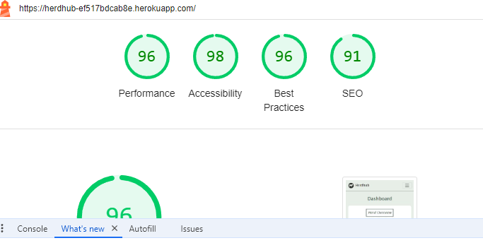 | 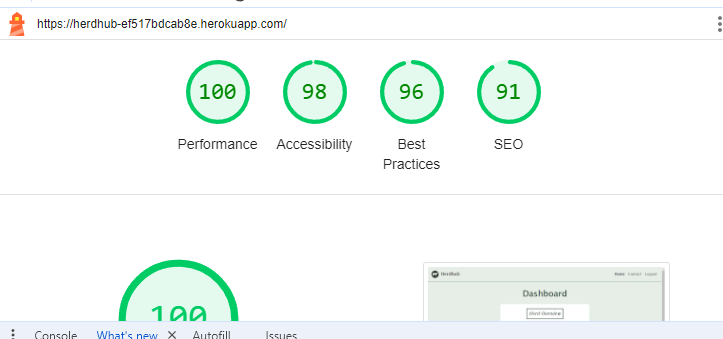 | Good performance on mobile and desktop |
| About | 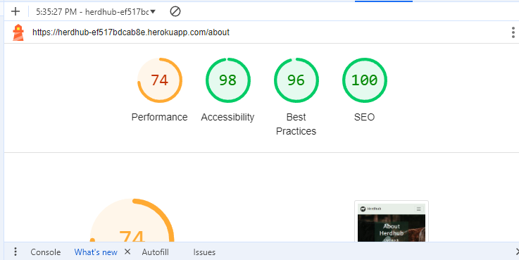 | 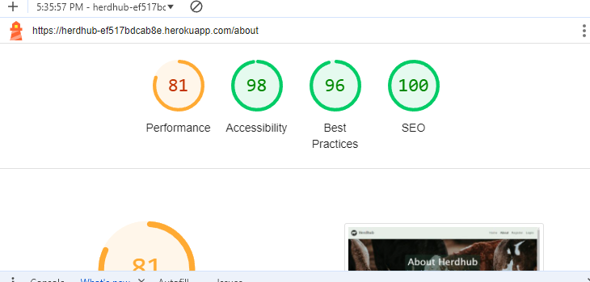 | Minor warnings for performance on mobile and desktop |
| Contact Page | 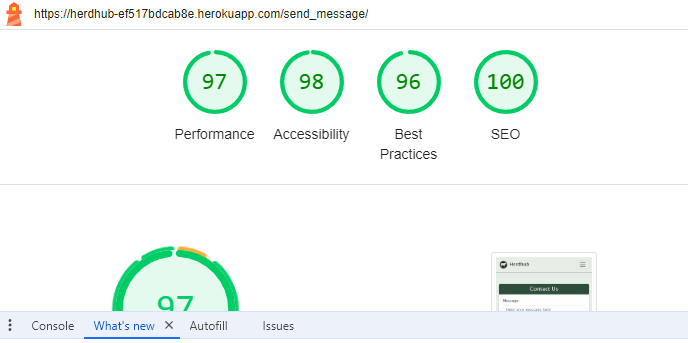 |  | Good performance on mobile and desktop |
| 404 |  |  | Good performance on mobile and desktop |
| 500 |  |  | Good performance on mobile and desktop |
| Sign In | 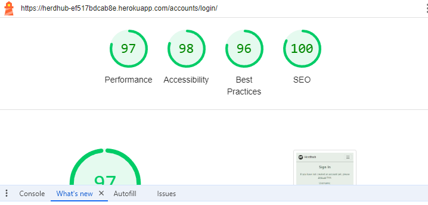 |  | Good performance on mobile and desktop |
| Sign Out | 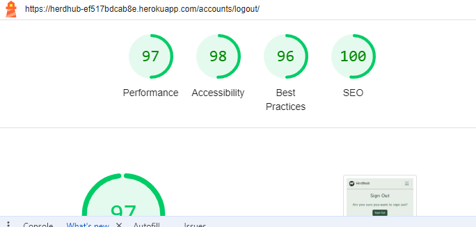 | 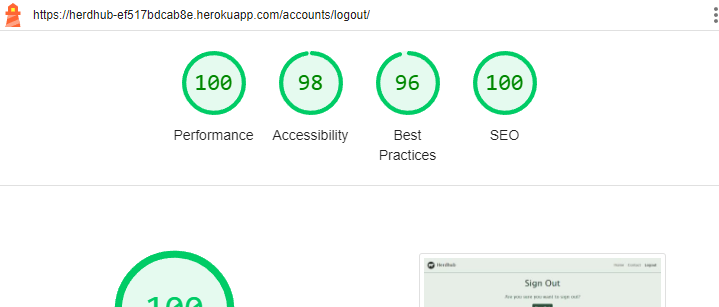 | Good performance on mobile and desktop |
| Sign Up | 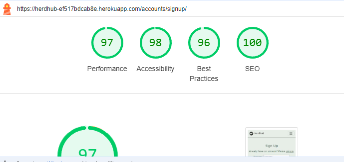 |  | Good performance on mobile and desktop |
| Add Cow | 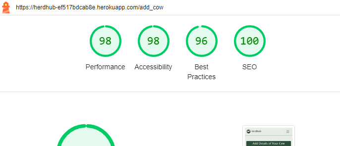 |  | Good performance on mobile and desktop |
| View Cow |  |  | Good performance on mobile and desktop |
| Edit Cow | 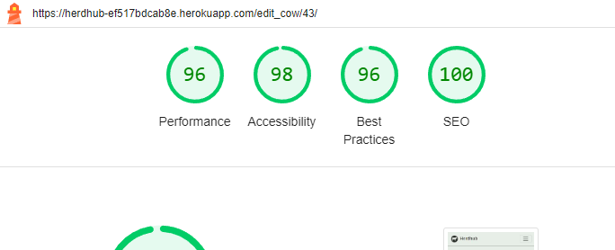 |  | Good performance on mobile and desktop |
| Add Bull | 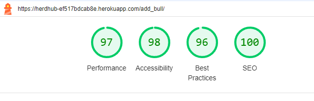 | 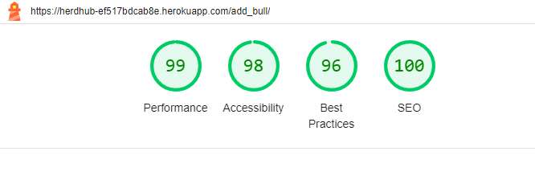 | Good performance on mobile and desktop |
| View Bull | 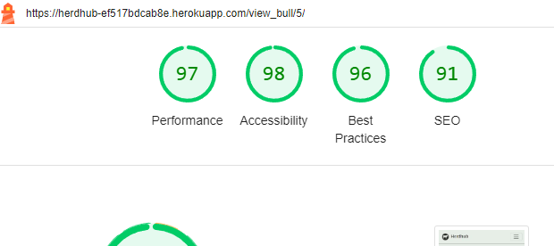 |  | Good performance on mobile and desktop |
| Edit Bull |  | 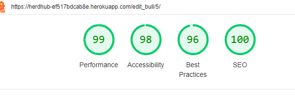 | Good performance on mobile and desktop |
| Add Breeding |  |  | Good performance on mobile and desktop |
| View Breeding | 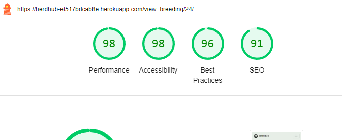 | 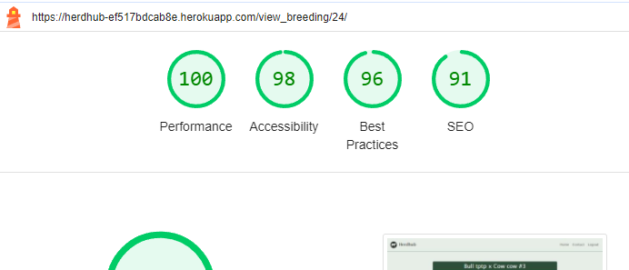 | Good performance on mobile and desktop |
| Edit Breeding |  | 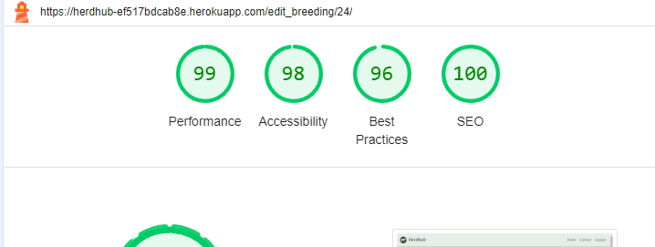 | Good performance on mobile and desktop |
| Add Calf |  |  | Good performance on mobile and desktop |
| View Calf |  | 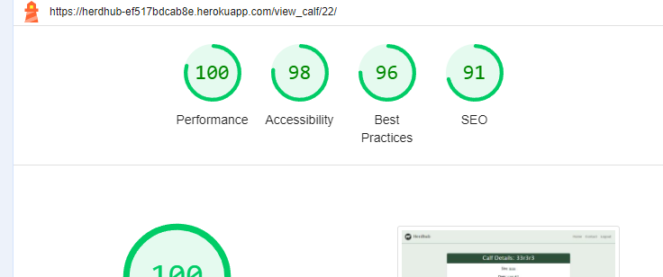 | Good performance on mobile and desktop |
| Edit Calf |  | 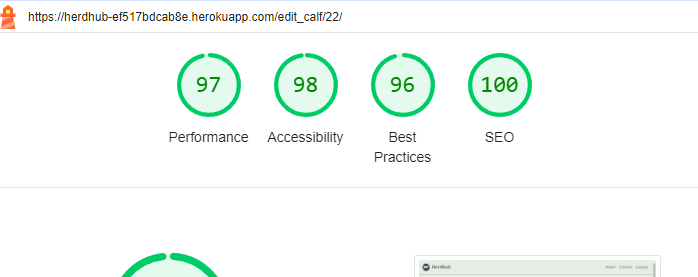 | Good performance on mobile and desktop |

## User Story Testing

### Users

| User Story | Screenshot/Comments |
| --- | --- |
| As a new user, I want to have a clear idea of the purpose of the web application so that I can understand the value that it would provide me. |  |
| As a user, I want to add photos to animal profiles so that I can include photos within my database.|  |
| As a user, I want to be able to log out easily so that I can be sure that my data remains secure after I have finished using the website. |  |
| As a user, I want to be able to change the details of a specific animal so that my database remains up-to-date. |  |
| As a user, I want to create profiles for each of my animals so that I can easily track their individual history and characteristics. |  |
| As a user, I want to view a list of all animals in my herd with key details shown, so that I can read an overview of my herd. |  |
| As a user, I want to be able to select a specific animal or breeding event and access comprehensive detailed overview of it. |  |
| As a user, I want to log breeding events so that I can monitor reproductive outcomes and optimise my breeding program. | 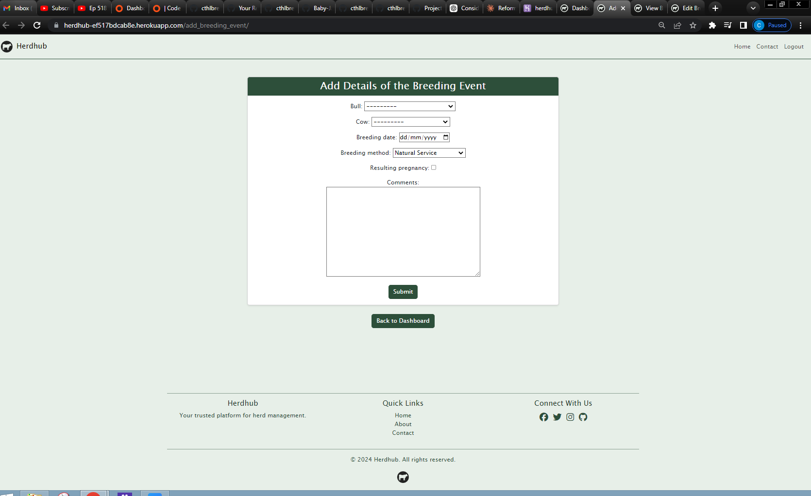 |
| As a user, I want to be able to delete animals from my database in case an animal is sold, dies, etc, so that I can maintain an accurate database. |  |
| As a user, I want to be able to register an account so that I can manage my livestock. |  |
| As a user, I want to be able to log in with a username and password so that I can securely access my data. |  |
| As a logged in user, I want to navigate my records easily so that I can easily access my data. |  |

### Product Owner

| User Story | Screenshot/Comments |
| --- | --- |
| As the product owner, I want to make sure that the models are full functional so that users don't experience bugs. | 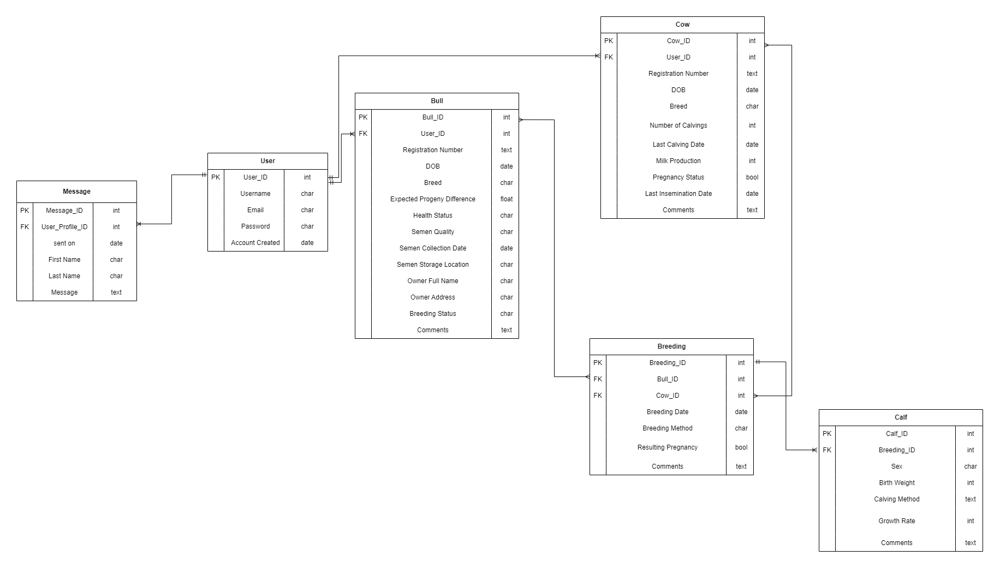 |
| As the product owner, I want users to get messages after they've logged in, logged out, successfully added an animal, etc so that they get immediate feedback on their interactions. |  |
| As the product owner, I want there to be an admin account so that the website can be monitored and maintained. |  |
| As the product owner, I want to make sure that all code is validated so that the code is clean, readable and maintainable. | See Code Validation seciton above |
| As the product owner, I want to ensure that my deployed website is linked to a cloud-based database. | See Deployment Section in README.md |
| As the product owner, I want to have the website deployed so that people can find and use my product. | See Deployment Section in README.md |
| As the product owner, I want the website to have a robust database schema that would serve the needs of users |  |
| As the product owner, I want the authentication pages to match the appearance of the rest of the site so that the site will have a coherent, consistent and professional appearance.| Sign In, Sign Out, Sign Up pages extend from base.html to fulfil this User Story |

### Site Administrator 

| User Story | Screenshot/Comments |
| --- | --- |
| As the administrator, I want to be able to securely access the admin page so that I can maintain and update the website easily. |  |
| As the administrator, I want to have CRUD functionality over all users' databases so that I can monitor and maintain the website. | Functionality provided through Admin Page shown above |
| As the administrator, I want users to be able to submit messages to me so that I can troubleshoot any problems they might have. |  |

## Defensive Programming

Defensive programming was manually tested with the below user acceptance testing:

| Page | User Action | Expected Result | Pass/Fail | Comments |
| --- | --- | --- | --- | --- |
| Home | | | | |
| | Click on Logo | Redirection to Home page | Pass | |
| | Click on Home link in navbar | Redirection to Home page | Pass | |
| Gallery | | | | |
| | Click on Gallery link in navbar | Redirection to Gallery page | Pass | |
| | Load gallery images | All images load as expected | Pass | |
| Contact | | | | |
| | Click on Contact link in navbar | Redirection to Contact page | Pass | |
| | Enter first/last name | Field will accept freeform text | Pass | |
| | Enter valid email address | Field will only accept email address format | Pass | |
| | Enter message in textarea | Field will accept freeform text | Pass | |
| | Click the Submit button | Redirects user to form-dump | Pass | User must click 'Back' button to return |
| Sign Up | | | | |
| | Click on Sign Up button | Redirection to Sign Up page | Pass | |
| | Enter valid email address | Field will only accept email address format | Pass | |
| | Enter valid password (twice) | Field will only accept password format | Pass | |
| | Click on Sign Up button | Asks user to confirm email page | Pass | Email sent to user |
| | Confirm email | Redirects user to blank Sign In page | Pass | |
| Log In | | | | |
| | Click on the Login link | Redirection to Login page | Pass | |
| | Enter valid email address | Field will only accept email address format | Pass | |
| | Enter valid password | Field will only accept password format | Pass | |
| | Click Login button | Redirects user to home page | Pass | |
| Log Out | | | | |
| | Click Logout button | Redirects user to logout page | Pass | Confirms logout first |
| | Click Confirm Logout button | Redirects user to home page | Pass | |
| Profile | | | | |
| | Click on Profile button | User will be redirected to the Profile page | Pass | |
| | Click on the Edit button | User will be redirected to the edit profile page | Pass | |
| | Click on the My Orders link | User will be redirected to the My Orders page | Pass | |
| | Brute forcing the URL to get to another user's profile | User should be given an error | Pass | Redirects user back to own profile |

## Automated Testing

For my project, I have used the [Jest](https://jestjs.io) JavaScript testing framework.

In order to work with Jest, I first had to initialize NPM.

- `npm init`
- Hit `enter` for all options, except for **test command:**, just type `jest`.

Add Jest to a list called **Dev Dependencies** in a dev environment:

- `npm install --save-dev jest`

**IMPORTANT**: Initial configurations

When creating the test files, the name of the file needs to be `file-name.test.js` in order for Jest to properly work. In my case, as I was testing a file in the static directory called script.js, I had to name the file 'script.test.js'. This is located in the tests folder, within the js folder in the static directory.

Without the following, Jest won't properly run the tests:

- `npm install -D jest-environment-jsdom`

All four Jest tests passed successfully. However, the third test did not work as expected, as the test could not identify the correct label element on the add_cow.html page despite much bug testing. Regardless, the proper functioning of this element passed manual testing as shown in the Defensive Programming section above.

- Jest Testing

## Bugs

## Unfixed Bugs

As noted, I could not get the third Jest test to work, despite much troubleshooting. This isn not particularly important as I was able to manually test the relevant Javascript functionally, but it is still notable as a bug of some description. 

There are no remaining bugs that I am aware of.
